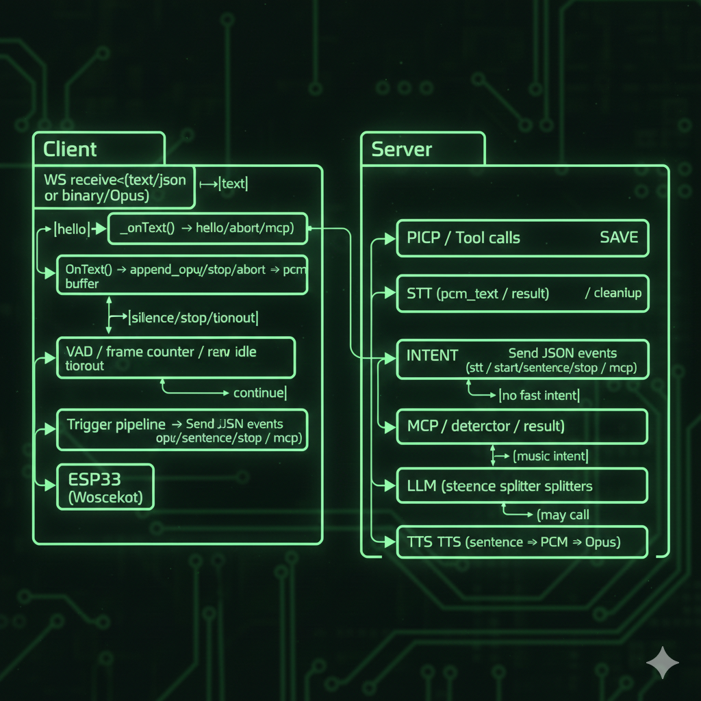

# custom_server_xiaozhi — XiaoZhi ESP32 Custom Server

Mục tiêu: Tạo server để giao tiếp với client (esp32 - xiaozhi)

## Quickstart

Yêu cầu
- Python 3.10+
- Các gói trong `requirements.txt`
- `ffmpeg` (dùng khi TTS trả MP3 cần convert → PCM)
- `libopus` (nếu dùng `opuslib`)

Chạy nhanh:

```bash
cd custom_server_xiaozhi
pip install -r requirements.txt
python run.py           
```

Server khởi động FastAPI/uvicorn và exposes:
- WebSocket endpoint: `/` 
- REST API router: under `/api/` (see `app/api/routes.py`)

## Architecture Overview


